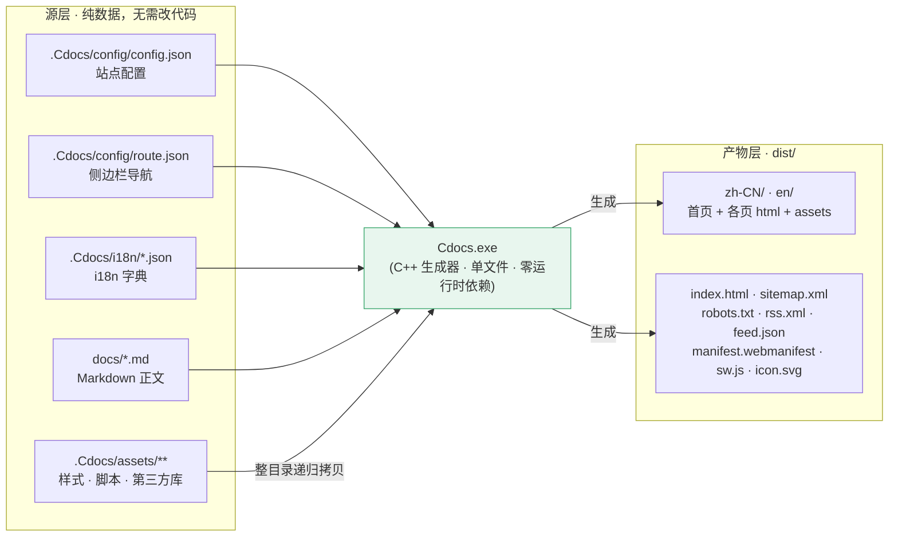
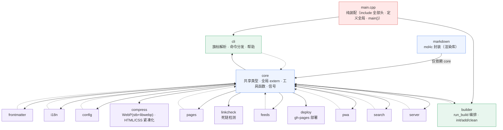
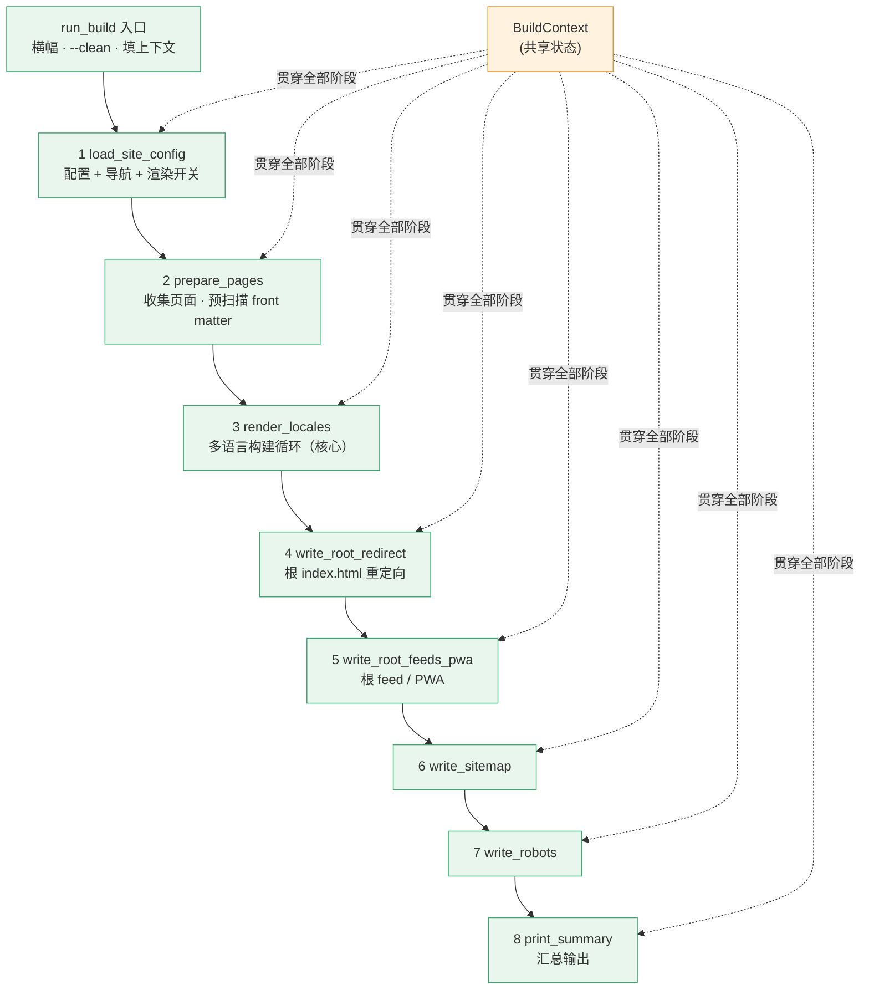

# Cdocs 架构说明

> 一个用 C++ 17 写的单文件静态文档站生成器（SSG）。
> 设计目标：站点配置 / 内容 / 导航 / 多语言全部数据驱动（改 JSON / Markdown 即可，无需动 C++）；
> 构建产物 **零运行时依赖**（RSS / JSON Feed / PWA / SEO 全部由生成器内建，无 Node 脚本）。
>
> 项目借鉴 Hugo 思路：所有「引擎」相关文件（C++ 源码、配置、i18n、前端资源、构建脚本、第三方依赖）
> 统一收口在隐藏目录 **`.Cdocs/`** 内；用户侧只需维护 `docs/` 源文与 `dist/` 产物。
> `Cdocs.exe` 可复制到系统 PATH，像 `hugo` 一样在任意终端、任意目录直接调用。

---

## 1. 整体架构（构建数据流）



**一句话流程**：`Cdocs.exe` 读源层 → 一步产出完整 `dist/`（HTML / SEO / sitemap / robots / search.json / RSS / JSON Feed / PWA）。**没有**构建后的 Node 后处理步骤——`gen_feeds()`、`gen_pwa()`、`gen_search_index()` 都是生成器 C++ 内建函数，RSS 与 PWA 的 `<head>` 注入也由生成器在写页时直接完成。

---

## 2. 目录结构

```text
Cdocs/
├── src/                            # ★ C++ 生成器源码（17 个模块，见 §3）
│   ├── core.hpp/.cpp               # 共享类型、全局 extern、工具函数、信号处理（唯一底座）
│   ├── frontmatter  i18n  config  pages  feeds  pwa  search  server  cli  builder  compress  linkcheck  deploy
│   ├── markdown.hpp/.cpp           # md4c 封装（Markdown → HTML，早期独立模块）
│   └── main.cpp                    # 纯装配：include 全部头 + 定义全局 + main()
├── Cdocs.exe                       # 已编译生成器（MinGW-W64 静态链接，单文件 8.5MB）
├── ARCHITECTURE.md                 # 本文档
├── README.md / serve.bat           # 说明 / 双击预览启动器
├── .Cdocs/                         # ★ 生成器引擎（输入 + 前端 + 工具 + 依赖收口）
│   ├── theme/                      # ★ 主题（一个主题 = 一个文件夹，见 docs/themes.md）
│   │   ├── theme.json              # 主题元数据（name / version / description / author）
│   │   ├── templates/layout.html   # 页面骨架（{{key}} 占位符注入数据子块）
│   │   └── assets/                 # 前端资源（整目录递归拷贝进 dist/assets/）
│   │       ├── css/                # style.css（双主题变量）· custom.css（用户自定义层）
│   │       ├── js/                 # app.js 引导 + main.js + core/ + features/
│   │       ├── pwa/                # sw.js · icon.svg（由 gen_pwa 拷贝到站点根）
│   │       └── icons/              # Lucide SVG 图标（style.css 以 ../icons/ 相对引用）
│   ├── config/                     # 站点配置
│   │   ├── config.json             # 标题 / 主题 / 插件 / 页眉页脚 / i18n / SEO / 压缩
│   │   └── route.json              # 侧边栏导航（至多 6 层嵌套）
│   ├── i18n/                       # i18n 字典（扁平 key → value）
│   │   ├── zh-CN.json
│   │   └── en.json
│   ├── tools/                      # 构建脚本（无 Node 后处理）
│   │   ├── build.cmd               # Windows 一键构建（编译生成器 → Cdocs.exe build）
│   │   └── build.sh                # Linux / macOS 对应脚本
│   ├── plugins/                    # 外部脚本插件（可选，见 docs/plugins.md）
│   └── deps/                       # ★ 第三方依赖统一收口
│       ├── mermaid.min.js / katex.* / auto-render.min.js   # 图 / 公式（运行时）
│       ├── highlight.min.js / highlight-theme.css          # 语法高亮（运行时）
│       ├── flexsearch.bundle.min.js                        # 客户端全文搜索（运行时）
│       ├── photoswipe*.min.js / photoswipe.min.css         # 图片灯箱（运行时懒加载）
│       ├── fonts/                  # KaTeX 字体（随 katex.min.css）
│       └── vendor/                 # 编译期 C/C++ 头文件（不随站点发布）
│           ├── md4c/               # Markdown 解析（C 源，用 gcc 编译）
│           └── nlohmann/json.hpp   # JSON 解析（C++ 头文件）
├── docs/                           # Markdown 源（中英 2 语言）
│   └── blog/                       # 博客流（可选；docs/blog/ 存在即自动收集为博客，见 §7）
├── .build/                         # 编译中间产物（.o 目标文件 + tmp/ 临时目录）· 非源码
└── dist/                           # ★ 构建产物（部署用，见 §6；默认开启压缩）
```

> **依赖统一收口原则**：所有第三方依赖都放进 `.Cdocs/deps/`。
> - **运行时依赖**（mermaid / katex / highlight / flexsearch / photoswipe / fonts）：由生成器整目录拷贝进 `dist/assets/deps/`，离线可用。
> - **编译期依赖**（`vendor/` 下的 md4c / nlohmann）：只参与 C++ 编译，**不**随站点发布（生成器拷贝 deps 时跳过 `vendor/`）。
>
> **主题收口原则**（2026-08-02）：主题 = `.Cdocs/theme/` 整个文件夹（theme.json 元数据 + templates 骨架 + assets 资源），复制文件夹即换主题；构建器优先读 `theme/`，旧版 `assets/`+`templates/` 直放引擎根的站点自动兼容。

---

## 3. 生成器模块化架构（src/）

生成器由 **17 个 C++ 模块** 组成，每个模块含 `.hpp` + `.cpp`；依赖方向严格向下：



- **`core` 是唯一底座**：`Page` / `NavNode` / `SiteConfig` / `RenderOpts` / `I18nDict` 等共享类型、全部 `g_*` 全局变量的 `extern` 声明、跨模块工具函数（slug / UTF-8 截断 / 日期解析 / 文件 IO / ANSI 颜色）、信号处理都在这里；其他模块只 `#include core.hpp`，互不直接引用。
- **领域模块**：`frontmatter`（YAML 解析）→ `i18n`（字典 + `{{key}}` 替换）→ `config`（config.json / route.json 解析）→ `pages`（导航树 / 收集 / 面包屑 / draft 过滤 / TOC）→ `feeds`（RSS 2.0 + JSON Feed）→ `pwa`（manifest + service worker）→ `search`（search.json 索引，含 tags 字段）→ `server`（内置 HTTP 预览 + 文件 watch）→ `compress`（构建期压缩：stb_image + libwebp 编 WebP 副本 + HTML/CSS 紧凑化）。
- **编排层**：`cli`（全局旗标解析 → 子命令分发 → 帮助 / 退出码）、`builder`（构建编排 + 站点生命周期 `init` / `add` / `clean`）。

### run_build 纯编排

`builder.cpp` 的核心 `run_build()` 已拆为「**BuildContext + 8 个阶段函数**」的纯编排——共享状态集中在 `BuildContext` 结构体（in/out 目录、草稿开关、cfg、i18n、fallbackUI、opt、pages），阶段函数体用局部引用别名绑定成员，逻辑逐字保留：



> 阶段 3 `render_locales` 是核心：对每个语言目录依次复制前端资源 / deps / 静态文件 → 生成首页 → 各文档页（含 TOC、面包屑、SEO head、编辑链接）→ search.json → 标签聚合页 → 404 → RSS / JSON Feed → PWA。

---

## 4. 前端模块化架构

`.Cdocs/assets/js/app.js` 是生成器注入的 **classic script**。它仅做一件事：动态 `import('./main.js')`，从而加载真正的 ESM 模块图——这样**无需修改 C++ 生成器**即可实现模块化。

```mermaid
flowchart TD
  BOOT["assets/js/app.js<br/>(classic script · 引导)"]:::boot
  MAIN["js/main.js · boot()"]:::entry

  subgraph CORE[core/ 基础设施]
    I18N["i18n.js<br/>T() · 字典"]:::core
    UTIL["util.js<br/>esc · highlight · 懒加载"]:::core
  end

  subgraph FEAT[features/ 功能模块 · 各 export initX()]
    F1["theme.js"]:::f
    F2["code.js"]:::f
    F3["admonitions.js"]:::f
    F4["diagrams.js"]:::f
    F5["nav.js"]:::f
    F6["search.js"]:::f
    F7["command-palette.js"]:::f
    F8["footer.js"]:::f
    F9["feedback.js"]:::f
    F10["lightbox.js"]:::f
    F11["jump.js"]:::f
    F12["pwa.js"]:::f
  end

  BOOT -->|动态 import| MAIN
  MAIN --> I18N
  MAIN --> UTIL
  MAIN --> F1 & F2 & F3 & F4 & F5 & F6 & F7 & F8 & F9 & F10 & F11 & F12
  CORE -.被各 feature 复用.-> FEAT

  classDef boot fill:#ffe8e8,stroke:#d9534f;
  classDef entry fill:#e8f6ee,stroke:#3aa76d;
  classDef core fill:#eef4ff,stroke:#5b8def;
  classDef f fill:#f3eefe,stroke:#8a63d2;
```

**关键约定**：Admonitions（`> [!type]`）、Mermaid 图表、KaTeX 公式全部是**客户端 JS 升级**（`features/diagrams.js` 懒加载 mermaid / katex，仅含图表/公式的页面才加载对应库）——所以静态 HTML 里看不到 `class="admonition"` 是**正常的**，不是 bug。

---

## 5. i18n 机制

采用行业标准 **`{{key}}` + 扁平 JSON 字典**：配置 / 模板里写 `{{siteTitle}}`，构建时按当前语言查字典替换为本地化文案。

- **构建时**：`i18n_replace()` 扫描 `{{key}}` 并查 `.Cdocs/i18n/<loc>.json`；**跳过 `<pre>/<script>/<style>`** 以免破坏代码与脚本（如 JSON-LD 在 `<script>` 内，故由构建时直接解析）。
- **运行时**：`window.__I18N__` 注入客户端，供纯前端动态文案（复制提示、搜索无结果等）取用。
- **多语言输出**：每语言独立目录 `dist/<loc>/`，根 `index.html` 用 `<meta http-equiv="refresh">` 重定向默认语言；每语言独立 `search.json` 与 `sitemap` 的 `hreflang` 交替。

---

## 6. 产物结构（dist/）

```text
dist/
├── index.html               # 根重定向页（meta refresh → 默认语言）
├── sitemap.xml              # 含 hreflang x-default 交替链接
├── robots.txt
├── rss.xml · feed.json      # 默认语言订阅源（根，内建生成）
├── manifest.webmanifest     # PWA manifest（内建生成）
├── sw.js · icon.svg         # PWA（内建拷贝）
├── assets/                  # 共享静态资源（style.css / js 模块 / deps 第三方库 / 字体）
├── zh-CN/                   # 中文站点（独立 index + 各页 html + assets + rss.xml + feed.json）
└── en/                      # 英文站点（结构同上）
```

---

## 7. 构建流程

`build.cmd`（Windows）/ `build.sh`（Linux·macOS）做两件事：**① 编译生成器 → ② 运行生成器出站点**。均需从项目根目录调用：

```text
[1/2] 编译：13 个 C++ 源（g++ -std=c++17）+ 3 个 vendor C 源（md4c，用 gcc）→ 静态链接 → Cdocs.exe
[2/2] Cdocs.exe build        → 生成完整 dist/（HTML / SEO / sitemap / robots / search.json / RSS / Feed / PWA）
```

> **编译要点**：① **md4c 是 C 源，必须用 `gcc` 当 C 编译**（`g++` 会按 C++ 处理并因 `void*` 隐式转换报错）；② 链接必须 `-static -static-libgcc -static-libstdc++`（把运行时打进 exe，否则换机缺 dll 打不开）；③ Windows 需 `-lws2_32`（serve 内置服务器用 winsock），Linux/macOS 换 `-pthread`；④ 中文输出靠 `main()` 里 `SetConsoleOutputCP(CP_UTF8)`（源码 UTF-8，控制台默认 GBK 会乱码）；⑤ Windows 用户名含中文时把 `TEMP` 指向 `.build\tmp`（纯 ASCII）规避写失败。
> 编译器：本机 MinGW-W64（`D:\deps_code\C_C++\mingw64`）。一键构建见 `.Cdocs/tools/build.cmd` / `build.sh`。

### 命令行（对标 Hugo / MkDocs）

```bash
Cdocs [全局旗标] <子命令> [参数]
```

**全局旗标**（放在子命令之前）：`-c/--config`、`-s/--source`、`-d/--dest`、`-q/--quiet`、`-V/--verbose`、`-h/--help`、`-v/--version`。

| 子命令 | 说明 | 常用旗标 |
|--------|------|----------|
| `init <目录>` | **建站**：生成完整站点骨架（配置 / i18n / 示例文档 / 引擎 + exe），并自动构建 | `--no-engine` 只出内容骨架 |
| `new <名>`（别名 `add`/`page`） | **建页**：用 archetype 生成 `<名>.md`，自动登记进 route.json 导航 | — |
| `build` | 构建站点（默认 `docs` → `dist`，位置参数可覆盖） | `-D/--drafts` 含草稿、`--clean` 先清空、`-q/-V` |
| `serve` | 构建并启动内置 HTTP 预览服务器（默认 8088，仅监听本机，端口被占自动顺延） | `-p/--port`、`-o/--open` 自动开浏览器、`-w/--watch` 热重载、`--no-build` |
| `clean` | 清空 dist | — |
| `version` / `help` | 版本 / 帮助 | — |

**退出码**：成功 `0`、运行错误 `1`、用法/未知命令 `2`。无参数运行打印帮助并退出（exit 0）；双击 exe 无参数打印帮助并等待 **Ctrl+C**（防窗口一闪而过）。`serve` 是常驻进程，按 Ctrl+C 干净退出。

> **挂到系统 PATH**：把 `Cdocs.exe` 放进 PATH 目录（如 `C:\Users\<user>\bin`），任意终端、任意目录都能直接 `Cdocs`。路径全部相对**当前终端目录（CWD）**解析——一个全局 exe 可服务任意多个站点（每个站点自带 `.Cdocs/` 引擎）。注意 PATH 安装是「exe + 引擎」配套：`bin` 目录需同时有 `Cdocs.exe` 和 `bin\.Cdocs\`（assets/deps），升级 exe 后要同步重拷引擎。

---

## 8. 第三方依赖

| 依赖 | 版本 | 用途 | 引入方式 |
|------|------|------|----------|
| md4c | — | Markdown 解析（C） | 随生成器编译（`.Cdocs/deps/vendor/md4c`，gcc） |
| nlohmann/json | — | 配置 / 导航 JSON 解析（C++） | 头文件（`.Cdocs/deps/vendor/nlohmann/json.hpp`） |
| highlight.js | 11.9.0 | 语法高亮 | `.Cdocs/deps/highlight.min.js`（客户端） |
| FlexSearch | 0.7.43 | 客户端全文搜索 | `.Cdocs/deps/flexsearch.bundle.min.js` |
| Mermaid | 10.9.1 | 流程图 / 时序图 | `.Cdocs/deps/mermaid.min.js`（懒加载） |
| KaTeX | 0.16.9 | 数学公式 | `.Cdocs/deps/katex.min.js` + `auto-render.min.js` + 字体（懒加载） |

> 所有**前端运行时库**均置于 `.Cdocs/deps/`，由生成器整目录递归拷贝进 `dist/assets/deps/`，**离线可用**。Mermaid 仅在含图表的页面加载，KaTeX 仅在含 `$` 的页面加载（懒加载）。**生成器本身零运行时依赖**：RSS / Feed / PWA / SEO 全部 C++ 内建，构建过程不需要 Node / Python。

---

## 9. 关键技术决策与约束

1. **单文件 CLI + 零运行时依赖**：`Cdocs.exe` 静态链接（`-static`），RSS / JSON Feed / PWA / SEO / 搜索索引全部内建，构建链只有「编译生成器 → 运行生成器」两步，无 Node 脚本。`serve` 内置 C++ HTTP 服务器（无需 Python/Node）。

2. **模块化兼容硬注入**：生成器硬编码注入 `<script src="assets/js/app.js">`（classic script）。故 `app.js` 退化为引导文件，用**动态 `import()`** 加载 ESM 模块图——既满足模块化编程，又无需改生成器。

3. **数据驱动优先**：站点外观与结构尽量用 `.Cdocs/config/config.json` / `.Cdocs/config/route.json` / `.Cdocs/i18n/` 表达，升级渲染内核（md4c、highlight.js 等）即可获得新能力，无需改业务代码。

4. **SEO / 多语言在构建时落地**：JSON-LD、canonical、sitemap `hreflang`、各语言 `search.json` 均由生成器在构建时产出，保证静态站点对爬虫友好。

5. **`config.json` 的 `url` 为占位** `https://docsgen.example.com`：上线前替换为真实域名，canonical / sitemap / RSS 链接才指向正确地址。

6. **引擎隐藏目录化（Hugo 式）**：源码、配置、i18n、前端资源、构建脚本、第三方依赖全部收口在 `.Cdocs/`，项目根只保留 `Cdocs.exe` / `docs/` / `dist/` 与少量元文件，用户侧使用路径对齐 Hugo 心智模型。

7. **草稿与生命周期**：front matter 的 `draft: true` 默认不发布，`build -D/--drafts` 强制包含（feeds / sitemap / 导航同步过滤）；`init` = 建站、`new` = 建页、`clean` = 清空产物，与 Hugo/Jekyll 语义一致。

---

## 10. 如何扩展

| 想加什么 | 改哪里 |
|----------|--------|
| 新页面 / 新内容 | 在 `docs/` 加 `.md`（`Cdocs new <名>` 自动登记），或在 `.Cdocs/config/route.json` 挂导航 |
| 改站点配置 / 外观 | 改 `.Cdocs/config/config.json`（标题、主题、页眉页脚、插件、主题变量、`home` 首页 hero/卡片白名单、`header.nav` 页眉右侧导航） |
| 新增一种语言 | 在 `.Cdocs/i18n/` 加字典 + `config.i18n.locales` 登记 + `docs/` 加对应 `.md` |
| 新交互功能 | 在 `.Cdocs/assets/js/features/` 加 `initX()` 模块，在 `main.js` 挂一行 |
| 改生成器逻辑 | 改 `src/` 对应模块（core 底座 / 领域模块 / cli / builder），重跑 `build.cmd` |
| 新构建产物 | 在 `builder.cpp` 的 `run_build` 阶段链里加一个阶段函数（BuildContext 已备好共享状态） |
| 升级渲染内核 | 替换 `.Cdocs/deps/` 中的对应库（运行时库直接换；md4c 替换 `.Cdocs/deps/vendor/md4c` 后重编） |
