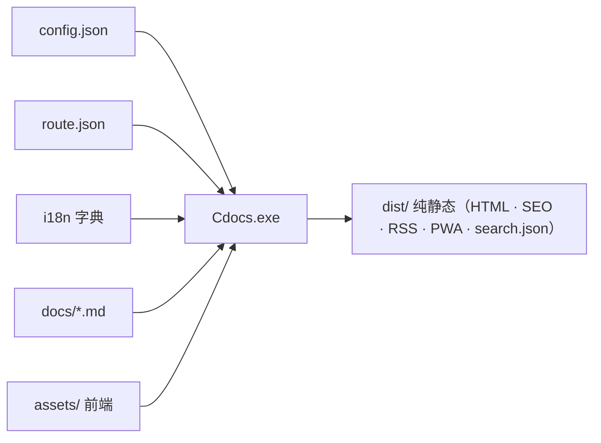

# 架构一览

Cdocs 的核心设计是**数据驱动 + 引擎收口**：所有"引擎"相关文件统一收口在隐藏目录 `.Cdocs/` 内，用户侧只维护 `docs/`（内容）与 `dist/`（产物）。

## 整体数据流



## 生成器：13 个 C++ 模块

生成器源码在 `src/`，按职责拆成模块（每个含 `.hpp` + `.cpp`），依赖方向严格向下：

| 层 | 模块 | 职责 |
|----|------|------|
| 装配 | `main.cpp` | 纯装配：include 全部头 + 定义全局 + `main()` |
| 底座 | `core` | 共享类型 / 全局 extern / 工具函数 / 信号处理 |
| 领域 | `frontmatter` | YAML front matter 解析 |
| 领域 | `i18n` | 字典加载 + `{{key}}` 替换 |
| 领域 | `config` | config.json / route.json 解析 |
| 领域 | `pages` | 导航树 / 收集 / 面包屑 / 草稿过滤 / TOC |
| 领域 | `feeds` | RSS 2.0 + JSON Feed |
| 领域 | `pwa` | manifest + service worker |
| 领域 | `search` | search.json 索引 |
| 领域 | `server` | 内置 HTTP 预览 + 文件 watch |
| 编排 | `cli` | 全局旗标解析 / 子命令分发 / 帮助 / 退出码 |
| 编排 | `builder` | `run_build` 编排 + `init`/`add`/`clean` |
| 渲染 | `markdown` | md4c 封装（Markdown → HTML，早期独立） |

## run_build：纯编排

`builder.cpp` 的核心 `run_build()` 是「BuildContext + 8 个阶段函数」的纯编排：共享状态集中在 `BuildContext` 结构体，各阶段函数用局部引用别名绑定成员，逻辑逐字保留。

1. `load_site_config` — 配置 + 导航 + 插件渲染开关
2. `prepare_pages` — 输入检查 + 收集页面 + 预扫描 front matter
3. `render_locales` — 多语言构建循环（核心：首页/文档页/search/标签/404/RSS/PWA）
4. `write_root_redirect` — 多语言根 index.html 重定向
5. `write_root_feeds_pwa` — 根目录默认语言 feed / PWA
6. `write_sitemap` — sitemap.xml
7. `write_robots` — robots.txt
8. `print_summary` — 汇总输出

## 前端：引导 + ESM 模块图

`assets/app.js` 只做一件事：动态 `import('./js/main.js')` 加载 ESM 模块图。交互增强（主题 / 代码块 / 提示框 / 图表 / 搜索 / 命令面板 / 灯箱 / PWA）都是 `features/*.js` 里的 `initX()` 模块——**无需修改 C++ 生成器即可加前端功能**。

> 重要约定：Admonitions（`> [!type]`）、Mermaid、KaTeX 都是**客户端 JS 升级**，静态 HTML 里看不到 `class="admonition"` 是**正常的**。

## 构建链：两步，零依赖

```text
build.cmd → ① 编译 13 个 C++ 源（g++ -std=c++17）+ 3 个 vendor C 源（md4c，用 gcc）
           → ② Cdocs.exe build 生成完整 dist/（RSS / Feed / PWA / SEO 全内建）
```

编译要点：md4c 是 C 源必须用 `gcc`；链接必须 `-static -static-libgcc -static-libstdc++`（自带运行时）；Windows 加 `-lws2_32`（serve 用 winsock）。

详细说明见项目根 `ARCHITECTURE.md`。
