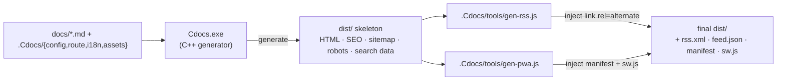

# Render Pipeline

Here, "render pipeline" means the **build pipeline** that turns the `docs/` sources into a deployable static site. It is "generator compile + three post-processing steps", all chained by `build.cmd` / `build.sh`.

## Overview

The build runs in four steps (labeled `[0/3]`–`[3/3]` in the script):

## [0/3] Compile the generator

Only compiled when `Cdocs.exe` is missing or any source file is newer than the exe. Key rules:

- **md4c is C source, so it must be compiled with `gcc`** (g++ would treat it as C++ and fail on `void*` conversions); `main.cpp` / `markdown.cpp` use `g++ -std=c++17`.
- Link with **`-static -static-libgcc -static-libstdc++`** so the runtime is baked into the exe; otherwise it won't run on another machine missing `libstdc++-6.dll`.
- Windows links **`-lws2_32`** (for the `serve` built-in server); Linux/macOS use `-pthread` instead.
- The entry calls `SetConsoleOutputCP(CP_UTF8)` so Chinese output is not mangled; when the Windows username contains non-ASCII characters, `build.cmd` points the temp dir at `.build\tmp` (pure ASCII) to avoid write failures.

## [1/3] Generate the site

`Cdocs.exe` reads the data layer and produces `dist/`:

- Each Markdown file → a standalone `<locale>/<file>.html` (sidebar, TOC, breadcrumb, pager, SEO `<head>`, JSON-LD).
- Emits `sitemap.xml` (with `hreflang`), `robots.txt`, `canonical`, prev/next `rel`, and per-language `search.json`.
- Recursively copies `.Cdocs/assets/` and `.Cdocs/deps/` (third-party libs) into `dist/assets/` — **offline-capable**.
- The root `index.html` redirects to the default locale via `<meta http-equiv="refresh">`.

## [2/3] Generate RSS / JSON Feed

`.Cdocs/tools/gen-rss.js` (pure Node, built-in modules only) reads the generated HTML, produces RSS 2.0 and JSON Feed, and injects `<link rel="alternate">` into each page's `<head>`. Title/description come from the already-i18n-resolved HTML; the summary is the first paragraph.

## [3/3] Generate PWA

`.Cdocs/tools/gen-pwa.js` copies `sw.js` / `icon.svg`, writes a per-language `manifest.webmanifest`, injects `<link rel="manifest">` and `theme-color`, and bumps the Service Worker cache version (clearing stale caches) so visited pages work offline.

## Extending the build

To add a step, drop a pure-Node script (built-in modules only) into `.Cdocs/tools/` and call it with `node` from `build.cmd` / `build.sh`. Version switchers, OG share images, and similar outputs all live on this "post-process after generation" path, decoupled from the C++ generator.

## FAQ

> [!warning]
> Opening `dist/*.html` directly via `file://` restricts PWA, Service Worker and some fetch calls. Use `Cdocs serve` or any static server (e.g. `python -m http.server`) over `http://`.

> [!tip]
> Before going live, change `config.json`'s `url` to the real domain — otherwise canonical / sitemap / RSS links all point at the placeholder `https://docsgen.example.com`.
