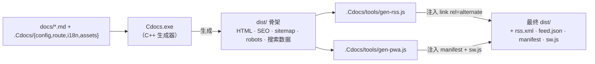

# 渲染管线

这里的「渲染管线」指 Cdocs 把 `docs/` 源文变成可部署静态站点的**构建链路**。它由「生成器编译 + 三步后处理」组成，全部由 `build.cmd` / `build.sh` 一键串联。

## 总览

构建分四步（脚本里标为 `[0/3]`～`[3/3]`）：

## [0/3] 编译生成器

仅当 `Cdocs.exe` 缺失或任一源文件比 exe 更新时才编译。关键约定：

- **md4c 是 C 源，必须用 `gcc`**（g++ 会按 C++ 报 `void*` 转换错）；`main.cpp` / `markdown.cpp` 用 `g++ -std=c++17`。
- 链接带 **`-static -static-libgcc -static-libstdc++`**，把运行时打进 exe，否则换机运行会因缺 `libstdc++-6.dll` 打不开。
- Windows 链接 **`-lws2_32`**（供 `serve` 内置服务器用）；Linux/macOS 换成 `-pthread`。
- 入口设 `SetConsoleOutputCP(CP_UTF8)` 保证中文不乱码；Windows 用户名含中文时，`build.cmd` 把临时目录指向 `.build\tmp`（纯 ASCII）规避写入失败。

## [1/3] 生成站点

`Cdocs.exe` 读取数据层，产出 `dist/`：

- 每篇 Markdown → 独立 `<locale>/<file>.html`（含侧边栏、目录、面包屑、分页、SEO `<head>`、JSON-LD）。
- 生成 `sitemap.xml`（含 `hreflang`）、`robots.txt`、`canonical`、上下篇 `rel`、各语言 `search.json`。
- 递归拷贝 `.Cdocs/assets/` 与 `.Cdocs/deps/`（第三方库）进 `dist/assets/`，**离线可用**。
- 根 `index.html` 用 `<meta http-equiv="refresh">` 重定向默认语言。

## [2/3] 生成 RSS / JSON Feed

`.Cdocs/tools/gen-rss.js`（纯 Node，仅用内置模块）读取已生成的 HTML，产出 RSS 2.0 与 JSON Feed，并向各页 `<head>` 注入 `<link rel="alternate">`。标题 / 描述取自已 i18n 解析的 HTML，摘要取首段。

## [3/3] 生成 PWA

`.Cdocs/tools/gen-pwa.js` 拷贝 `sw.js` / `icon.svg`，写各语言 `manifest.webmanifest`，注入 `<link rel="manifest">` 与 `theme-color`，并升级 Service Worker 缓存版本号（清掉旧缓存），实现「已访问页断网可看」。

## 如何扩展构建产物

新增一步 = 在 `.Cdocs/tools/` 加一个纯 Node 脚本（仅依赖内置模块），再在 `build.cmd` / `build.sh` 里 `node` 调一下即可。例如版本切换、OG 分享图等，都走这条「生成后再处理」的链路，与 C++ 生成器解耦。

## 常见问题

> [!warning]
> 直接以 `file://` 双击打开 `dist/*.html`，PWA、Service Worker、部分 fetch 会受限。请用 `Cdocs serve` 或任意静态服务器（如 `python -m http.server`）以 `http://` 访问。

> [!tip]
> 上线前务必把 `config.json` 的 `url` 改成真实域名，否则 canonical / sitemap / RSS 里的链接都指向占位地址 `https://docsgen.example.com`。
