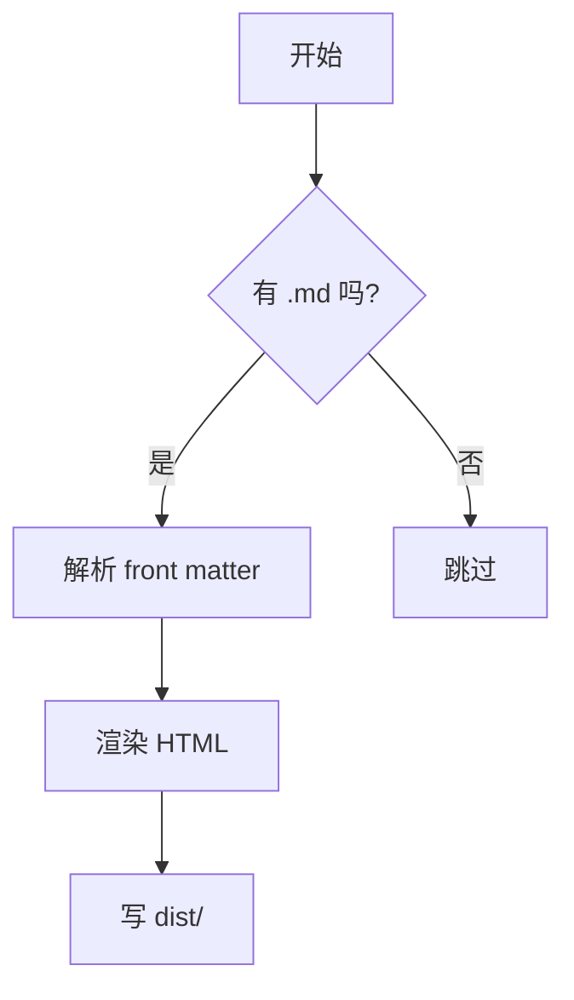
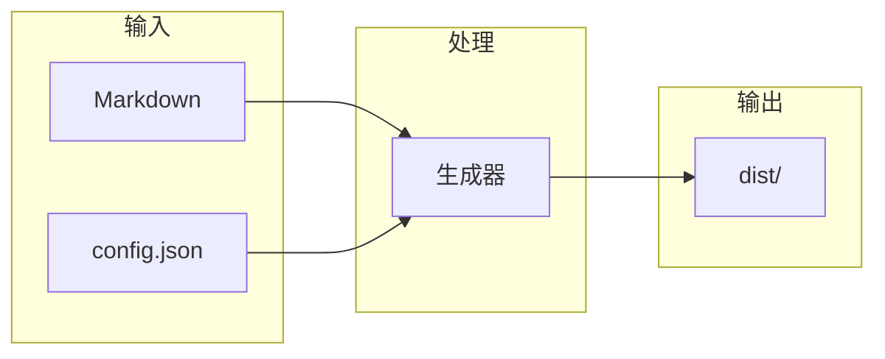
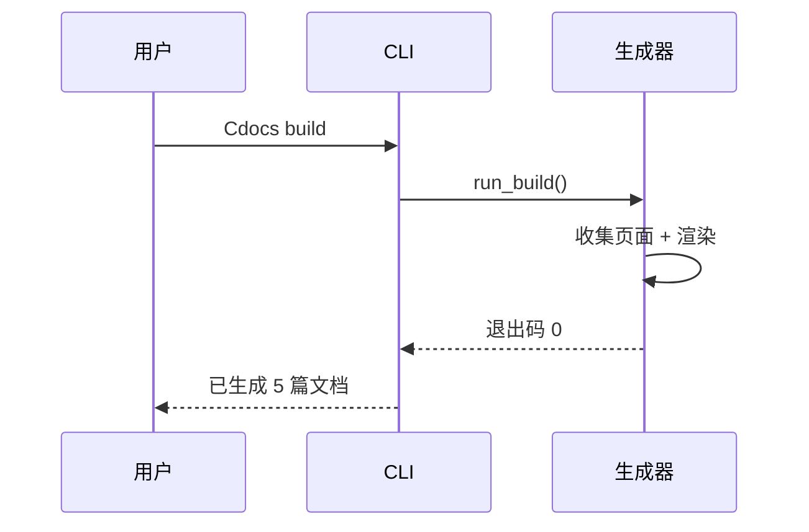
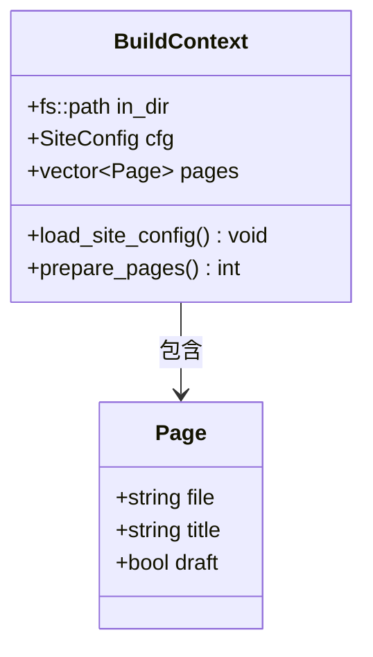
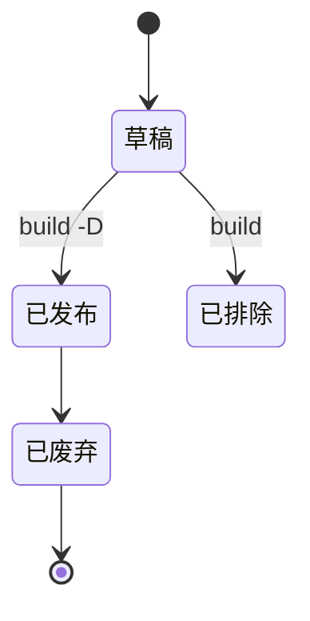
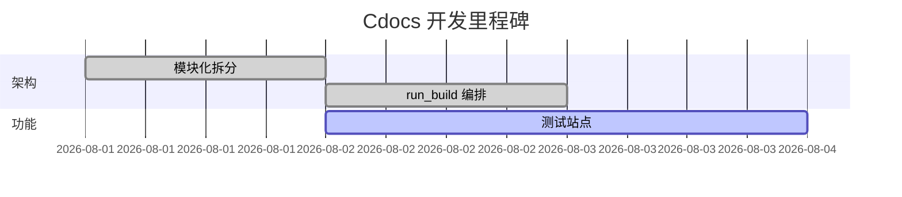
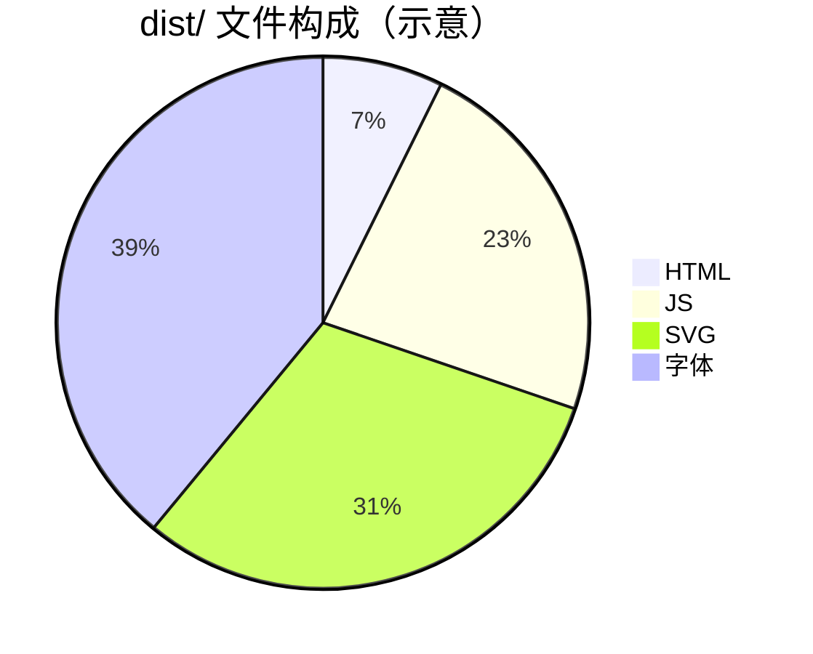
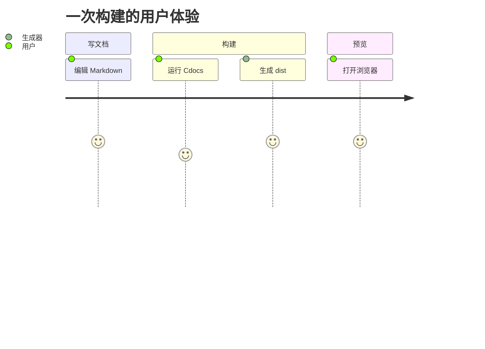

# Mermaid 图表测试

本页验证 Mermaid 图表渲染（客户端懒加载 `mermaid.min.js`）。图表写在与代码块相同的围栏里，语言标记为 `mermaid`。

## 流程图（flowchart）

## 时序图（sequence）

## 类图（class）

## 状态图（state）

## 甘特图（gantt）

## 饼图（pie）

## 旅程图（journey）

