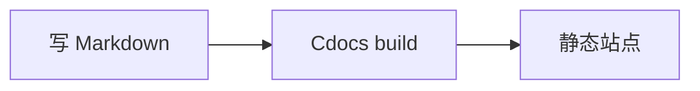

# Markdown 渲染测试

本页覆盖常用 Markdown 语法，验证生成器的渲染正确性。看到的效果即最终产物效果。

## 标题层级

# H1
## H2
### H3
#### H4
##### H5

## 文本样式

**粗体**、*斜体*、***粗斜体***、~~删除线~~、`行内代码`、<kbd>Ctrl</kbd>+<kbd>K</kbd>。

## 引用

> 单层引用。
>
> > 嵌套引用。

## 列表

有序列表：

1. 第一项
2. 第二项
   1. 嵌套 2.1
   2. 嵌套 2.2
3. 第三项

无序列表：

- 苹果
- 香蕉
  - 子项 A
  - 子项 B
- 樱桃

任务列表：

- [x] 已完成任务
- [ ] 未完成任务

## 表格

| 语法 | 示例 | 效果 |
|------|------|------|
| 标题 | `# H1` | H1 |
| 粗体 | `**文本**` | **文本** |
| 链接 | `[文本](#)` | [文本](#) |
| 行内代码 | `` `code` `` | `code` |

| 对齐测试 | 左 | 中 | 右 |
|:--------|:---|:--:|---:|
| 列 1 | left | center | right |

## 代码块

```cpp
#include <iostream>
int main() {
    std::cout << "Hello, Cdocs!" << std::endl;   // 语法高亮
    return 0;
}
```

```python
def greet(name: str) -> str:
    return f"Hello, {name}!"
```

```json
{
  "plugins": ["search", "dark-mode", "toc"],
  "i18n": { "defaultLocale": "zh-CN" }
}
```

## 链接

- [内部页面：命令行参考](../generator/commands.html)
- [外部链接：Hugo](https://gohugo.io/)
- [锚点跳转](#标题层级)
- 自动链接：<https://www.rust-lang.org/>

## 图片


## Admonition（提示框）

> [!note] 这是 note 提示
> 普通说明内容。

> [!tip] 这是 tip 提示
> 一个小技巧。

> [!warning] 这是 warning 警告
> 需要注意的内容。

> [!danger] 这是 danger 危险
> 高风险内容。

## 分隔线与转义

---

`*不是斜体*`，`# 不是标题`。

## 数学公式（行内）

行内公式示例：$E = mc^2$，欧拉恒等式 $e^{i\pi} + 1 = 0$。更多公式见 [KaTeX 测试页](test-katex.html)。

## 图表（内嵌）



更多图表见 [Mermaid 测试页](test-mermaid.html)。
