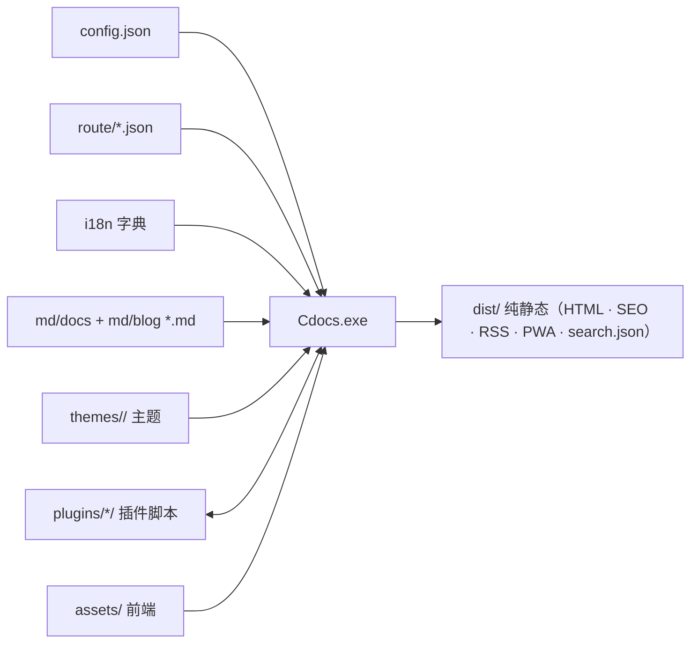

# 架构一览

Cdocs 的核心设计是**数据驱动 + 引擎收口**：所有"引擎"相关文件统一收口在隐藏目录 `.Cdocs/` 内，用户侧只维护 `md/`（内容）与 `dist/`（产物）。

## 整体数据流



## 生成器：25 个 C++ 模块

生成器源码在 `src/`，按职责拆成模块（每个含 `.hpp` + `.cpp`），依赖方向严格向下：

| 层 | 模块 | 职责 |
|----|------|------|
| 装配 | `main.cpp` | 纯装配：include 全部头 + 定义全局 + `main()` |
| 底座 | `core` | 共享类型 / 全局 extern / 工具函数 / 信号处理 |
| 领域 | `frontmatter` | YAML front matter 解析 |
| 领域 | `i18n` | 字典加载 + `{{key}}` 替换 |
| 领域 | `config` | config.json / route.json 解析 |
| 领域 | `pages` | 导航树 / 收集 / 面包屑 / 草稿过滤 / TOC |
| 领域 | `feeds` | RSS 2.0 + JSON Feed |
| 领域 | `pwa` | manifest + service worker |
| 领域 | `search` | search.json 索引 |
| 领域 | `server` | 内置 HTTP 预览 + 文件 watch |
| 领域 | `linkcheck` | 死链检查（构建期扫描站内链接） |
| 领域 | `compress` | 构建期压缩（WebP 图片 + HTML/CSS） |
| 领域 | `deploy` | git 推送 / Vercel / 自动化部署配置生成 |
| 领域 | `plugin` | 外部脚本钩子（on_config / on_done …） |
| 渲染 | `markdown` | md4c 封装 + Admonitions 展开 |
| 渲染 | `component` | 组件加载 / 数据孔填充 / 地图 sections 组合 / 站点数据 |
| 渲染 | `shortcode` | 正文 shortcode 引擎（预扫描 / 展开 / style 去重 / 转义） |
| 构建 | `builder` | `run_build` 纯编排（配置→收集→渲染），`render_one_locale` 单语言渲染子函数 |
| 构建 | `versions` | 多版本分派（config.versions 探测 + md-* 快照约定 + 根重定向） |
| 构建 | `output` | 构建收尾产物（根重定向 / feed+PWA / sitemap / robots / 汇总 / 残留检测） |
| 构建 | `ctxdata` | 页面数据装配（PageCtx + link/nav/cards/pager/header/footer json） |
| 构建 | `site_config` | 配置加载（config.json 三区块 + route 映射 + 侧边栏导航） |
| 构建 | `render_pages` | 页面类型渲染（首页/文档页/博客流/搜索/标签/single + head 数据） |
| 脚手架 | `scaffold` | `init` / `section` / `new` / `clean` 站点骨架命令 |
| 编排 | `cli` | 命令注册表分发 / 统一 flag 解析 / 帮助 / 退出码 |
| 诊断 | `diag` | `doctor` / `check` / `config` / `routes` / `theme` / `plugins` / `versions` 诊断命令 |

> 演进：早期把渲染部件与脚手架命令都堆在 `builder.cpp`（一度 3200 行）；v2 拆出 `component` / `shortcode` / `scaffold` / `diag`；v3 再拆 `versions` / `output`，并把 `render_locales` 的单语言渲染循环体提取为 `render_one_locale`；v4 三拆 `ctxdata`（数据装配）/ `site_config`（配置加载）/ `render_pages`（页面类型渲染），`render_one_locale` 从 652 行瘦到编排（113 行），`builder.cpp` 1734 → 708 行；v5 拆分剩余巨型函数（`scaffold.cmd_init` 330→52 行、`site_config.parse_site_block` 245→38 行），**全项目无超 150 行函数**。

## run_build：纯编排

`builder.cpp` 的核心 `run_build()` 是「BuildContext + 8 个阶段函数」的纯编排：共享状态集中在 `BuildContext` 结构体，各阶段函数用局部引用别名绑定成员，逻辑逐字保留。

1. `load_site_config`（site_config.cpp）— 配置 + 导航 + 插件渲染开关
2. `prepare_pages` — 输入检查 + 收集页面 + 预扫描 front matter
3. `render_locales` — 多语言构建循环（每语言调 `render_one_locale`）
   - `render_one_locale` — 单语言编排（assets/压缩/指纹 → 调 render_pages.cpp 六种页面渲染 → feeds/PWA）
4. `write_root_redirect` — 多语言根 index.html 重定向
5. `write_root_feeds_pwa` — 根目录默认语言 feed / PWA
6. `write_sitemap` — sitemap.xml
7. `write_robots` — robots.txt
8. `print_summary` — 汇总输出

> `versions.cpp` 在 `run_build` 最外层执行版本分派（`dispatch_versions`）：命中多版本（config.versions 或 md-* 快照约定）则对每个版本独立调 `run_build` 并生成根重定向；单版本/子构建重入时不处理，走下方主流程。`output.cpp` 承载 4-9 阶段的收尾产物函数。

## 前端：引导 + ESM 模块图

`assets/app.js` 只做一件事：动态 `import('./js/main.js')` 加载 ESM 模块图。交互增强（主题 / 代码块 / 提示框 / 图表 / 搜索 / 命令面板 / 灯箱 / PWA）都是 `features/*.js` 里的 `initX()` 模块——**无需修改 C++ 生成器即可加前端功能**。

> 约定：Admonitions（`> [!type]`）与 shortcode 组件是**构建期渲染**，静态 HTML 里直接可见；Mermaid、KaTeX 是**客户端 JS 懒加载升级**。

## 构建链：两步，零依赖

```text
build.cmd → ① 编译 25 个 C++ 源（g++ -std=c++17）+ 3 个 vendor C 源（md4c，用 gcc）
           → ② Cdocs.exe build 生成完整 dist/（RSS / Feed / PWA / SEO 全内建）
```

编译要点：md4c 是 C 源必须用 `gcc`；链接必须 `-static -static-libgcc -static-libstdc++`（自带运行时）；Windows 加 `-lws2_32`（serve 用 winsock）。

发布：`.Cdocs/tools/make_release.py` 生成 `release/`（exe + 引擎资源，排除编译中间产物），加入 PATH 即可全局使用。

---

## 目录结构

```text
Cdocs/
├── src/                            # ★ C++ 生成器源码（25 个模块，见上文模块表）
│   ├── core.hpp/.cpp               # 共享类型、全局 extern、工具函数、信号处理（唯一底座）
│   ├── main.cpp                    # 纯装配：include 全部头 + 定义全局 + main()
│   └── <其余 23 个模块>.hpp/.cpp    # 领域 / 渲染 / 构建 / 脚手架 / 编排 / 诊断
├── Cdocs.exe                       # 已编译生成器（MinGW-W64 静态链接，单文件 ~10MB）
├── Cdocs-linux                     # Linux 版生成器（GitHub Actions 预编译，供 Vercel 云端直接运行）
├── release/                        # ★ 发布包（make_release.py 生成，exe + .Cdocs，入 PATH 即全局可用）
├── vercel.json                     # Vercel 部署配置（Cdocs deploy --setup 插件生成，必须留根目录）
├── .github/workflows/              # 自动部署（deploy.yml / build-linux-binary.yml，插件生成）
├── .gitattributes                  # 行尾规范化（*.sh/*.yml/*.py → LF，*.bat/*.cmd → CRLF）
├── README.md / serve.bat           # 说明 / 双击预览启动器
├── .Cdocs/                         # ★ 生成器引擎（配置 + 主题 + 插件 + 依赖收口）
│   ├── config/                     # 站点配置
│   │   ├── config.json             # 标题 / 主题(themeName) / 插件 / 页眉页脚 / i18n / SEO / 压缩 / 版本化 / 路由映射
│   │   ├── map.json                # 页面地图注册表（type → theme/map/*.json）
│   │   └── route/                  # ★ 分文件侧边栏（每个版本 / 博客区一份，如 docs.json / blog.json）
│   ├── i18n/                       # i18n 字典（扁平 key → value）
│   │   ├── zh-CN.json
│   │   └── en.json
│   ├── themes/                     # ★ 多主题仓库（一个主题 = 一个文件夹，见 reference/themes.md）
│   │   ├── ink/                    #   默认主题（theme.json + map/ + components/ + assets/）
│   │   ├── paper/                  #   纸质主题
│   │   └── frost/                  #   玻璃拟态主题
│   ├── plugins/                    # ★ 外部脚本插件（见 reference/plugins.md）
│   │   ├── blog-query/ tags-query/ #   数据查询（on_data_query：博客流 / 标签聚合）
│   │   ├── giscus/                 #   评论（on_config 注入）
│   │   ├── github-pages/ vercel/   #   部署配置生成（setup 钩子）
│   │   └── vercel-analytics/       #   统计（on_config 注入）
│   ├── tools/                      # 构建脚本
│   │   ├── build.cmd               # Windows 一键构建（编译生成器 → Cdocs.exe build）
│   │   ├── build.sh                # Linux / macOS 对应脚本
│   │   └── make_release.py         # 生成 release/ 发布包
│   └── deps/                       # ★ 第三方依赖统一收口
│       ├── mermaid.min.js / katex.* / auto-render.min.js   # 图 / 公式（运行时）
│       ├── highlight.min.js / highlight-theme.css          # 语法高亮（运行时）
│       ├── flexsearch.bundle.min.js                        # 客户端全文搜索（运行时）
│       ├── photoswipe*.min.js / photoswipe.min.css         # 图片灯箱（运行时懒加载）
│       ├── fonts/                  # KaTeX 字体（随 katex.min.css）
│       └── vendor/                 # 编译期 C/C++ 头文件（不随站点发布）
│           ├── md4c/               # Markdown 解析（C 源，用 gcc 编译）
│           └── nlohmann/json.hpp   # JSON 解析（C++ 头文件）
├── md/                             # ★ Markdown 源根（唯一内容根）
│   ├── docs/                       # 当前版本文档（中英 2 语言，按主题分子目录）
│   ├── docs-v1/                    # 历史版本快照（可选；多版本时存在）
│   ├── blog/                       # 博客流（可选；md/blog/ 存在即自动收集为博客）
│   └── static/                     # 内容静态资源（图片等，随构建拷入 dist）
├── .build/                         # 编译中间产物（.o 目标文件 + tmp/ 临时目录）· 非源码
└── dist/                           # ★ 构建产物（部署用，见参考；默认开启压缩）
```

> **依赖统一收口原则**：所有第三方依赖都放进 `.Cdocs/deps/`。
> - **运行时依赖**（mermaid / katex / highlight / flexsearch / photoswipe / fonts）：由生成器整目录拷贝进 `dist/assets/deps/`，离线可用。
> - **编译期依赖**（`vendor/` 下的 md4c / nlohmann）：只参与 C++ 编译，**不**随站点发布（生成器拷贝 deps 时跳过 `vendor/`）。
>
> **主题收口原则**：主题 = `themes/<name>/` 整个文件夹（theme.json 元数据 + map 骨架 + components 组件 + assets 资源），复制文件夹 + 改 `themeName` 即换主题。
>
> **查询插件化原则**：博客流排序 / 分页 / 首页文章流、标签聚合等**数据查询逻辑 100% 在 Python 插件**（`on_data_query` 钩子）实现，引擎只产数据快照、不内置任何查询——改脚本即可自定义查询行为。

---

## 第三方依赖

| 依赖 | 版本 | 用途 | 引入方式 |
|------|------|------|----------|
| md4c | — | Markdown 解析（C） | 随生成器编译（`.Cdocs/deps/vendor/md4c`，gcc） |
| nlohmann/json | — | 配置 / 导航 JSON 解析（C++） | 头文件（`.Cdocs/deps/vendor/nlohmann/json.hpp`） |
| highlight.js | 11.9.0 | 语法高亮 | `.Cdocs/deps/highlight.min.js`（客户端） |
| FlexSearch | 0.7.43 | 客户端全文搜索 | `.Cdocs/deps/flexsearch.bundle.min.js` |
| Mermaid | 10.9.1 | 流程图 / 时序图 | `.Cdocs/deps/mermaid.min.js`（懒加载） |
| KaTeX | 0.16.9 | 数学公式 | `.Cdocs/deps/katex.min.js` + `auto-render.min.js` + 字体（懒加载） |

> 所有**前端运行时库**均置于 `.Cdocs/deps/`，由生成器整目录递归拷贝进 `dist/assets/deps/`，**离线可用**。Mermaid 仅在含图表的页面加载，KaTeX 仅在含 `$` 的页面加载（懒加载）。**生成器本身零运行时依赖**：RSS / Feed / PWA / SEO 全部 C++ 内建，构建过程不需要 Node / Python。

---

## 关键技术决策与约束

1. **单文件 CLI + 零运行时依赖**：`Cdocs.exe` 静态链接（`-static`），RSS / JSON Feed / PWA / SEO / 搜索索引全部内建，构建链只有「编译生成器 → 运行生成器」两步，无 Node 脚本。`serve` 内置 C++ HTTP 服务器（无需 Python/Node）。

2. **模块化兼容硬注入**：生成器硬编码注入 `<script src="assets/js/app.js">`（classic script）。故 `app.js` 退化为引导文件，用**动态 `import()`** 加载 ESM 模块图——既满足模块化编程，又无需改生成器。

3. **数据驱动优先**：站点外观与结构尽量用 `.Cdocs/config/config.json` / `.Cdocs/config/route/` / `.Cdocs/i18n/` 表达，升级渲染内核（md4c、highlight.js 等）即可获得新能力，无需改业务代码。

4. **SEO / 多语言在构建时落地**：JSON-LD、canonical、sitemap `hreflang`、各语言 `search.json` 均由生成器在构建时产出，保证静态站点对爬虫友好。

5. **引擎隐藏目录化（Hugo 式）**：源码、配置、i18n、主题、插件、前端资源、构建脚本、第三方依赖全部收口在 `.Cdocs/`，用户侧只维护 `md/`（内容）与 `dist/`（产物）——使用路径对齐 Hugo 心智模型。

6. **查询 100% 插件化**：引擎不内置任何数据查询（博客流 / 标签聚合），全部由 Python 插件通过 `on_data_query` 钩子实现。插件协议 = 外部进程 + JSON 文件交换，失败自动隔离、永不阻断构建。

7. **主题 = 文件夹**：页面结构（map JSON）、组件（components）、资源（assets）全在一个文件夹内，换主题 = 换文件夹 + 改 `themeName`；机制组件缺失时从默认主题回退共享。

8. **草稿与生命周期**：front matter 的 `draft: true` 默认不发布，`build -D/--drafts` 强制包含（feeds / sitemap / 导航同步过滤）；`init` = 建站、`new` = 建页、`section` = 加内容区、`clean` = 清空产物，与 Hugo/Jekyll 语义一致。

---

## 如何扩展

| 想加什么 | 改哪里 |
|----------|--------|
| 新页面 / 新内容 | 在 `md/docs/` 加 `.md`（`Cdocs new <名>` 自动登记），或在 `.Cdocs/config/route/` 挂导航 |
| 改站点配置 / 外观 | 改 `.Cdocs/config/config.json`（标题、主题、页眉页脚、插件、主题变量、`home` 首页 hero/卡片白名单、`header.nav` 页眉右侧导航） |
| 换主题 | 在 `.Cdocs/config/config.json` 改 `site.themeName`（`themes/` 下选 ink / paper / frost） |
| 新增一种语言 | 在 `.Cdocs/i18n/` 加字典 + `config.i18n.locales` 登记 + `md/docs/` 加对应 `.md` |
| 自定义博客流 / 标签查询 | 改 `.Cdocs/plugins/blog-query/scripts/blog_query.py` 或 `tags_query.py`（每页条数、排序、首页条数） |
| 新交互功能 | 在 `themes/<name>/assets/js/features/` 加 `initX()` 模块，在 `main.js` 挂一行 |
| 新正文短代码 | 在 `themes/<name>/components/shortcodes/` 写 `<Name>.html`（见 [shortcode 参考](../reference/shortcodes)） |
| 新页面类型 | 在 `.Cdocs/config/map.json` 的 `maps` 数组加一项 `{type, map}`，再写 `theme/map/<type>.json` |
| 改生成器逻辑 | 改 `src/` 对应模块（core 底座 / 领域模块 / cli / builder），重跑 `build.cmd` |
| 新构建产物 | 在 `builder.cpp` 的 `run_build` 阶段链里加一个阶段函数（BuildContext 已备好共享状态） |
| 升级渲染内核 | 替换 `.Cdocs/deps/` 中的对应库（运行时库直接换；md4c 替换 `.Cdocs/deps/vendor/md4c` 后重编） |

