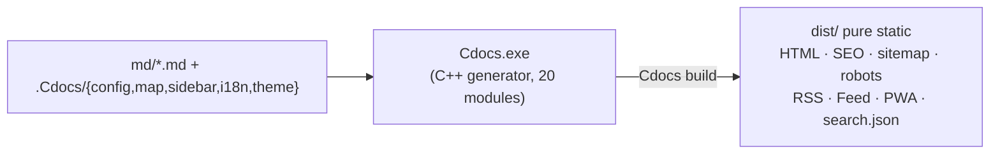

# Build Pipeline

The "build pipeline" is the full chain that turns `md/` sources into a deployable static site. It consists of "compile generator + one-step build", chained by `build.cmd` / `build.sh`.

## Overview

> Earlier versions split RSS / PWA into Node scripts (`.Cdocs/tools/gen-rss.js` / `gen-pwa.js`) run after the build; these are now folded into the C++ generator — **one command produces every artifact**, no Node runtime required.

## [0/2] Compile the generator

Compiles only when `Cdocs.exe` is missing or a source file is newer. Key conventions:

- **md4c is a C source — compile with `gcc`** (g++ would error on `void*` conversions); C++ sources use `g++ -std=c++17`.
- Link with **`-static -static-libgcc -static-libstdc++`** to bundle the runtime into the exe (otherwise the binary fails to start on machines without `libstdc++-6.dll`).
- Windows links **`-lws2_32`** (for the built-in `serve` server); Linux/macOS use `-pthread` instead.
- The entry sets `SetConsoleOutputCP(CP_UTF8)` so Chinese renders correctly; on Windows with non-ASCII usernames, temp dirs point to `.build\tmp` (pure ASCII) to avoid write failures.

## [1/2] Generate the site

`Cdocs.exe build` reads the data layer and produces **all** `dist/` artifacts in one step:

- Each Markdown file → `<locale>/<file>.html` (componentized pages: map JSON composes components — sidebar, TOC, breadcrumb, pager, SEO `<head>`, JSON-LD);
- Body render chain: shortcode pre-scan → md4c → Admonitions → shortcode expand → style dedup (see [Body Rendering](./render));
- Per-language `search.json` (FlexSearch client-side retrieval);
- `sitemap.xml` (with `hreflang`), `robots.txt`, `canonical`, prev/next `rel`;
- RSS 2.0 + JSON Feed (built-in `feeds.cpp`, injecting `<link rel="alternate">` per page);
- PWA (built-in `pwa.cpp`): `manifest.webmanifest` + `sw.js` + cache-version fingerprint (visited pages work offline);
- Image compression (WebP), HTML/CSS minification, asset fingerprints (`compress.cpp`);
- Recursively copies `.Cdocs/theme/assets/` and `.Cdocs/deps/` (third-party libs) into `dist/assets/` — **fully offline**;
- Root `index.html` redirects to the default locale via `<meta http-equiv="refresh">`.

## Extending build output

Add an artifact = add a domain module under `src/` (like `feeds` / `pwa` / `search`) and call it from `run_build`'s final stages (`write_root_*`); or use **plugin hooks** (`.Cdocs/plugins/`, see [Plugin Development](../reference/plugins)) to post-process with external scripts on `on_done`.

## FAQ

> [!warning]
> Opening `dist/*.html` directly via `file://` restricts PWA, Service Worker and some fetches. Use `Cdocs serve` or any static server (e.g. `python -m http.server`) over `http://`.

> [!tip]
> Set the real domain in `config.json` `url` before going live — otherwise canonical / sitemap / RSS links all point at the placeholder.
