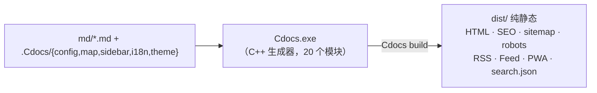

# 构建管线

这里的「构建管线」指 Cdocs 把 `md/` 源文变成可部署静态站点的**完整链路**。它由「生成器编译 + 一步构建」组成，全部由 `build.cmd` / `build.sh` 一键串联。

## 总览

> 早期版本把 RSS / PWA 拆成 Node 脚本（`.Cdocs/tools/gen-rss.js` / `gen-pwa.js`）在构建后处理；现已全部收口进 C++ 生成器，**一条命令产出全部产物**，无需 Node 运行时。

## [0/2] 编译生成器

仅当 `Cdocs.exe` 缺失或任一源文件比 exe 更新时才编译。关键约定：

- **md4c 是 C 源，必须用 `gcc`**（g++ 会按 C++ 报 `void*` 转换错）；C++ 源码用 `g++ -std=c++17`。
- 链接带 **`-static -static-libgcc -static-libstdc++`**，把运行时打进 exe，否则换机运行会因缺 `libstdc++-6.dll` 打不开。
- Windows 链接 **`-lws2_32`**（供 `serve` 内置服务器用）；Linux/macOS 换成 `-pthread`。
- 入口设 `SetConsoleOutputCP(CP_UTF8)` 保证中文不乱码；Windows 用户名含中文时，临时目录指向 `.build\tmp`（纯 ASCII）规避写入失败。

## [1/2] 生成站点

`Cdocs.exe build` 读取数据层，一步产出 `dist/` 全部产物：

- 每篇 Markdown → 独立 `<locale>/<file>.html`（组件化页面：地图 JSON 组合组件，含侧边栏、目录、面包屑、分页、SEO `<head>`、JSON-LD）；
- 正文渲染链：shortcode 预扫描 → md4c → Admonitions → shortcode 展开 → style 去重（见 [正文渲染](./render)）；
- 每语言 `search.json`（FlexSearch 客户端检索）；
- `sitemap.xml`（含 `hreflang`）、`robots.txt`、`canonical`、上下篇 `rel`；
- RSS 2.0 + JSON Feed（`feeds.cpp` 内建，向各页注入 `<link rel="alternate">`）；
- PWA（`pwa.cpp` 内建）：`manifest.webmanifest` + `sw.js` + 缓存版本指纹（已访问页断网可看）；
- 图片压缩（WebP）、HTML/CSS 压缩、资源指纹（`compress.cpp`）；
- 递归拷贝 `.Cdocs/theme/assets/` 与 `.Cdocs/deps/`（第三方库）进 `dist/assets/`，**离线可用**；
- 根 `index.html` 用 `<meta http-equiv="refresh">` 重定向默认语言。

## 如何扩展构建产物

新增产物 = 在 `src/` 加一个领域模块（如 `feeds` / `pwa` / `search`），在 `run_build` 的收尾阶段（`write_root_*` 系列）调用；或通过**插件钩子**（`.Cdocs/plugins/`，见 [插件开发](../reference/plugins)）在 `on_done` 时用外部脚本后处理。

## 常见问题

> [!warning]
> 直接以 `file://` 双击打开 `dist/*.html`，PWA、Service Worker、部分 fetch 会受限。请用 `Cdocs serve` 或任意静态服务器（如 `python -m http.server`）以 `http://` 访问。

> [!tip]
> 上线前务必把 `config.json` 的 `url` 改成真实域名，否则 canonical / sitemap / RSS 里的链接都指向占位地址。
