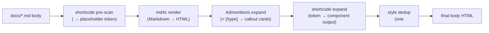

# Body Rendering

"Rendering" here means the complete pipeline that turns **one Markdown source file** into **the final body HTML**. It is the core of the build pipeline, fully implemented in C++ (`src/shortcode.cpp` + `src/markdown.cpp`).

## Overview

## Stage 1: shortcode pre-scan (before md4c)

Components can be embedded in the body with the `<Component/>` tag syntax (see the [shortcode reference](../reference/shortcodes)). The pre-scanner runs **before md4c**:

- Recognizes **capitalized** tags — `<Tabs>`, `<Tab label="Windows">…</Tab>`, `<Badge type="new"/>` (lowercase `
`/`
` are native HTML handled by md4c, zero conflict);
- Replaces each whole shortcode (**including its inner content**) with a unique placeholder token (`@@CDOCS_SC_<n>@@`);
- Skips tags inside fenced code blocks and inline code (md4c escapes their `<` to `&lt;`, naturally safe);
- `\<Name>` backslash prefix → rendered as a literal (teaching scenarios showing `<Tabs>` text);
- Unclosed paired tags → warning; nesting depth capped at 16.

## Stage 2: md4c render (Markdown → HTML)

The pre-scanned body is handed to md4c (CommonMark + GFM extensions). Only placeholder tokens remain, so **shortcode content never passes through Markdown parsing** — this is the key design decision: if component content stayed inline, md4c would treat `<Callout>` as an HTML block and **not render Markdown inside it**, breaking slot Markdown. The pre-scan avoids that.

## Stage 3: Admonitions expand

VitePress-style blockquotes — `> [!note]`, `> [!warning]`, etc. (11 types) — are expanded into callout-card HTML by `render_admonitions`. This happens at **build time** (previously a client-side JS upgrade; now built into the generator).

## Stage 4: shortcode expand (token → component output)

Scans the body HTML for placeholder tokens and replaces each with the component's rendered output:

- The component's **inner content** recursively runs the full pipeline (pre-scan → md4c → admonitions → expand) and fills `{{slot}}` (so slot Markdown works and nested shortcodes are natural);
- shortcode **attributes** (`label="Windows"`) → props in the component's data scope (`{{label}}` inside the component);
- `{{slot_raw}}` = the inner content escaped verbatim (for code components, `<`/`>` won't be treated as tags by the browser);
- Missing / cyclic components → warning (build does not fail);
- Body rendering is **multi-threaded**: the instance table and style-dedup table are `thread_local`; the shared warning set is mutex-guarded.

## Stage 5: style dedup

Component files may embed `<style>` blocks (componentized styles). When the same component is used multiple times in one document, `<style>` is kept **only once in the final output** (CSS is global, position-independent); `<script>` and structure stay per-instance (interactions must bind to their own containers). Dedup must run once on the final output — nested components' styles live inside their parent's output, so component-level dedup would wrongly remove them.

## Related files

| Module | Role |
|--------|------|
| `src/markdown.cpp` | md4c wrapper + `render_admonitions` |
| `src/shortcode.cpp` | pre-scan / expand / dedup / escape (public surface: `render_doc_body`) |
| `src/component.cpp` | component loading, data-hole filling, site data (`{{key}}` / `{{slot}}`) |
| `themes/<name>/components/shortcodes/*.html` | built-in shortcode component files |
