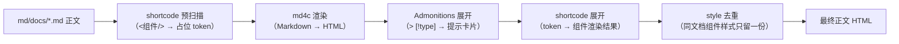

# 正文渲染

这里的「渲染」指 Cdocs 把**一篇 Markdown 源文**变成**一段最终 HTML 正文**的完整链路。它是整条构建管线的核心环节，全部由生成器 C++ 完成（`src/shortcode.cpp` + `src/markdown.cpp`）。

## 总览

## 阶段一：shortcode 预扫描（md4c 之前）

正文里可以用 `<组件/>` 标签语法嵌入组件（详见 [shortcode 参考](../reference/shortcodes)）。预扫描器在 md4c **之前**处理正文：

- 识别 `<Tabs>` / `<Tab label="Windows">…</Tab>` / `<Badge type="new"/>` 等**首字母大写**标签（小写 `
`/`
` 是原生 HTML，md4c 原样处理，互不干扰）；
- 把整个 shortcode（**含子内容**）替换成唯一占位 token（`@@CDOCS_SC_<n>@@`）；
- 跳过代码围栏与行内代码内的标签（md4c 会把其中的 `<` 转义成 `&lt;`，天然安全）；
- `\<Name>` 反斜杠前缀 → 转义为字面量（教学场景显示 `<Tabs>` 字样）；
- 双标签不配对闭合 → 警告；嵌套深度上限 16。

## 阶段二：md4c 渲染（Markdown → HTML）

预扫描后的正文交给 md4c（CommonMark + GFM 扩展）渲染成 HTML。此时正文里只剩占位 token，**shortcode 的原始内容不会经过 Markdown 解析**——这是本设计的关键：如果组件内容直接放在正文里，md4c 会把 `<Callout>` 当 HTML 块且**不渲染块内 Markdown**，slot 里的 Markdown 就失效了。预扫描规避了这一点。

## 阶段三：Admonitions 展开

`> [!note]` / `> [!warning]` 等 VitePress 风格块引用（11 种类型）由 `render_admonitions` 展开为提示卡片 HTML。这一步是**构建期**完成的（旧版是客户端 JS 升级，现已在生成器内建）。

## 阶段四：shortcode 展开（token → 组件渲染）

扫描正文 HTML 中的占位 token，逐个替换为组件渲染结果：

- 组件的**子内容**独立递归走「预扫描 → md4c → admonitions → 展开」完整管线，结果填进 `{{slot}}`（所以 slot 里的 Markdown 正常生效，嵌套 shortcode 天然支持）；
- shortcode 的**属性**（`label="Windows"`）→ 组件数据作用域的 props（组件里 `{{label}}` 可取）；
- `{{slot_raw}}` = 子内容原文转义（代码组件用，`<`/`>` 不会被浏览器当标签）；
- 组件缺失 / 循环引用 → 警告（构建不失败）；
- 正文渲染是**多线程**的：实例表与 style 去重表均为 `thread_local`，共享警告集合加互斥锁。

## 阶段五：style 去重

组件文件可内嵌 `<style>` 块（样式组件化）。同文档内同一组件使用多次时，`<style>` 只在**最终输出**保留一份（CSS 全局生效，位置无关）；`<script>` 与结构每处保留（交互要绑定各自容器）。去重必须放在最终输出做一次——嵌套组件的 style 嵌在父组件输出内，若在组件级去重会把父组件内部的子组件 style 误删。

## 相关文件

| 模块 | 职责 |
|------|------|
| `src/markdown.cpp` | md4c 封装 + `render_admonitions` |
| `src/shortcode.cpp` | 预扫描 / 展开 / 去重 / 转义（对外仅 `render_doc_body`） |
| `src/component.cpp` | 组件加载、数据孔填充、站点数据（`{{key}}` / `{{slot}}`） |
| `themes/<name>/components/shortcodes/*.html` | 内置 shortcode 组件文件 |
