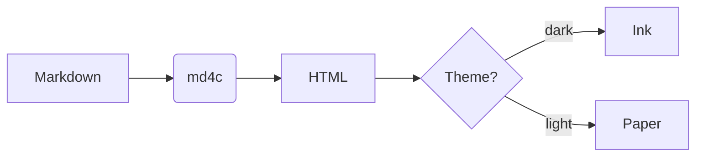

# Guide

## Use as a command-line tool

Cdocs is a single-file command-line tool written in C++. Once compiled it is `Cdocs.exe`
(Windows) / `Cdocs` (Linux·macOS). It reads the config and front-end assets under `.Cdocs/`
and renders the Markdown under `md/docs/` into a static site in `dist/`.

### One-shot build (recommended)

Run the build script from the project root — it compiles the generator first (only when
`Cdocs` is missing or the source changed), then generates the site and adds RSS / PWA:

```bash
# Windows
.Cdocs\tools\build.cmd

# Linux / macOS
bash .Cdocs/tools/build.sh
```

### Subcommands

Cdocs uses Hugo-style subcommands:

```bash
Cdocs                     # no command = build (docs → dist)
Cdocs build [in] [out]    # build the site, defaults to docs → dist
Cdocs serve [-p PORT]     # build and start a local preview (built-in server, default http://localhost:8088)
Cdocs new  <dir>          # scaffold a new site in the given directory
Cdocs version             # show version
Cdocs help                # show help
```

Common flags:

```bash
Cdocs build docs public   # explicit input/output dirs
Cdocs serve -p 3000       # change preview port
Cdocs serve --no-build    # skip build, preview existing dist
Cdocs serve -d public     # preview a specific directory
```

- **serve** runs a small static HTTP server written in C++ — **no Python or Node required** — bound to `127.0.0.1` only.
- **new** copies the engine (`.Cdocs`), `Cdocs.exe` and a sample `md/docs/intro.md` into the target dir, so the new site is ready to `build` / `serve`.

Drop your `.md` files into `md/docs/`, run it, and `dist/` will contain `<name>.html` per page
plus `index.html`, `style.css` and the search / SEO outputs.

> Backward compatible: `Cdocs docs dist` (positional args) still works, equivalent to `Cdocs build docs dist`.

### Compile manually

If you prefer not to use the build script, compile it yourself (needs MinGW-W64 g++ / gcc):

```cpp
# 1) md4c is C source — must be compiled with gcc as C (g++ treats it as C++ and fails on void*)
gcc -c .Cdocs/deps/vendor/md4c/md4c.c      -I .Cdocs/deps/vendor -I .Cdocs/deps/vendor/md4c -o .build/md4c.o
gcc -c .Cdocs/deps/vendor/md4c/md4c-html.c -I .Cdocs/deps/vendor -I .Cdocs/deps/vendor/md4c -o .build/md4c-html.o
gcc -c .Cdocs/deps/vendor/md4c/entity.c    -I .Cdocs/deps/vendor -I .Cdocs/deps/vendor/md4c -o .build/entity.o
# 2) C++ sources with g++
g++ -c src/main.cpp    -std=c++17 -I .Cdocs/deps/vendor -I .Cdocs/deps/vendor/md4c -o .build/main.o
g++ -c src/markdown.cpp -std=c++17 -I .Cdocs/deps/vendor -I .Cdocs/deps/vendor/md4c -o .build/markdown.o
# 3) link (-static bundles the runtime; -lws2_32 is needed by the serve server)
g++ .build/md4c.o .build/md4c-html.o .build/entity.o .build/main.o .build/markdown.o -o Cdocs.exe -static -static-libgcc -static-libstdc++ -lws2_32
```

> Tip: on Windows, if your username contains non-ASCII characters, point TEMP to a plain-ASCII path or the
> assembler stage will fail to write; `build.cmd` already handles this (uses `.build\tmp`).
> Compiler: local MinGW-W64 (`D:\deps_code\C_C++\mingw64`).

## Supported syntax

- Headings: `#` ~ `######`
- Lists: `- item`
- Blockquote: `> text`
- Links: [text](#)
- Tables, strikethrough, task lists (via md4c's GFM extensions)

### Syntax cheat sheet

| Syntax | Write | Meaning |
| --- | --- | --- |
| Heading | `# Heading` | Level-1 heading |
| Bold | `**text**` | Emphasis |
| Strikethrough | `~~text~~` | Strike line |
| Code | `` `code` `` | Inline code |

### Roadmap

- [x] Markdown rendering (via md4c)
- [x] Config-driven sidebar
- [x] Full-text search (FlexSearch, title/content split + hit highlighting)
- [x] Code syntax highlighting (via highlight.js)
- [x] Light/dark dual themes + system follow
- [x] Breadcrumbs, last updated, reading time
- [x] Collapsible sidebar groups, mobile drawer, copy-code button
- [x] Per-page SEO (title / description / OpenGraph)
- [x] sitemap.xml / robots.txt / canonical / prev-next / JSON-LD structured data
- [x] Edit this page link
- [x] Custom 404 page
- [x] Multi-language / i18n (`{{key}}`+json standard)
- [x] ⌘K / Ctrl+K full-screen command palette search
- [x] Admonitions ( > [!note] etc.)
- [x] Code-block enhancements (filename header / line numbers / line highlighting)
- [x] Mermaid diagrams (` ```mermaid `)
- [x] KaTeX math (`$$...$$` / `$...$`)
- [x] RSS 2.0 / JSON Feed subscription
- [x] PWA offline (Service Worker + manifest; revisit cached pages offline)
- [x] Print / Export PDF (`@media print` + footer print button)
- [x] "Was this page helpful?" feedback bar
- [x] Image lightbox (click to zoom)
- [x] Search jump-to-location (scroll + flash-highlight the match)
- [x] Code-block language label (shown even without a filename)

## Extra capabilities

### Admonitions

Start a blockquote with `> [!type]` to render an icon + colored callout. Supported types:
`note` / `info` / `tip` / `success` / `example` / `warning` / `caution` / `danger` / `bug` / `important` / `question`.

> [!note]
> A plain note, for background or caveats.

> [!warning]
> Some features only work when served over http; opening via `file://` is restricted.

> [!tip]
> Tip: press `⌘K` (or `Ctrl+K`) any time to bring up the full-screen command palette.

### Code-block enhancements

The fence info string accepts `lang:filename{highlight-lines}`: it auto-adds a filename
header, line numbers, and highlights the given lines.

```cpp:render_pipeline.cpp{1,3-5}
// Render pipeline: Markdown -> HTML -> page template
md_html(src, len, append_cb, &out, flags, 0);
build_toc(out);          // inject anchors + right-hand TOC
i18n_replace(out, dict); // replace template placeholders
```

Each code block has a "Copy" button at the top-right; the copied text excludes line numbers.

### Diagrams (Mermaid)

Write a ` ```mermaid ` code block to render flowcharts, sequence diagrams, class diagrams, and more:



> [!tip]
> Diagrams re-color themselves when you switch between light and dark themes.

### Math (KaTeX)

Inline math uses `$...$`, display math uses `$$...$$`:

The mass–energy equivalence $E = mc^2$ is central to special relativity.

$$
\int_{-\infty}^{\infty} e^{-x^2}\,dx = \sqrt{\pi}
$$

### RSS subscription

The site provides both RSS 2.0 and JSON Feed for feed readers:

- RSS: `rss.xml` (site root, default language)
- Per language: `/en/rss.xml`, etc.
- JSON Feed: `feed.json`

> To add new syntax, edit `config.json` without touching code; the rendering core is a mature library — upgrade it to gain new capabilities.
