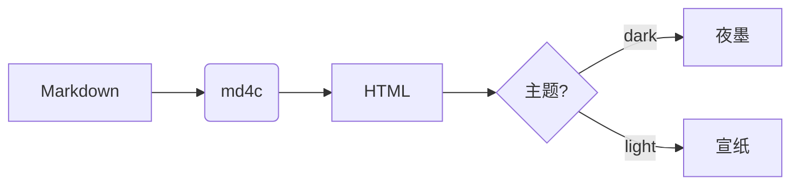

# 使用指南

## 作为命令行工具使用

Cdocs 是一个用 C++ 编写的单文件命令行工具，编译后即为 `Cdocs.exe`（Windows）/ `Cdocs`（Linux·macOS）。
它读取 `.Cdocs/` 下的配置与前端资源，把 `md/docs/` 下的 Markdown 渲染成静态站点 `dist/`。

### 一键构建（推荐）

在项目根目录执行构建脚本——它会先编译生成器（当 `Cdocs.exe` 缺失或源码有更新时），
再生成站点并补齐 RSS / PWA：

```bash
# Windows
.Cdocs\tools\build.cmd

# Linux / macOS
bash .Cdocs/tools/build.sh
```

### 子命令

Cdocs 采用 Hugo 式子命令，编译完成后可直接调用：

```bash
Cdocs -h                  # 帮助（无参数运行也打印帮助）
Cdocs init mysite         # 建站：新建完整站点骨架并自动构建
Cdocs new my-page         # 建页：新建一篇文档并登记导航
Cdocs section blog        # 加内容区（分类）
Cdocs build [输入] [输出]  # 构建站点，默认 md → dist
Cdocs serve [-p 端口]     # 构建并启动本地预览（内置服务器，默认 http://localhost:8088）
Cdocs doctor              # 环境自检
Cdocs check               # 质量检查（死链/token/数据孔）
Cdocs routes              # 页面路由清单
Cdocs version             # 查看版本
```

常用旗标：

```bash
Cdocs build --clean       # 构建前清空输出目录
Cdocs build -D            # 包含草稿（默认排除）
Cdocs build docs public   # 指定输入/输出目录
Cdocs serve -p 3000       # 换预览端口
Cdocs serve --no-build    # 跳过构建，直接预览现有 dist
Cdocs serve -o -w         # 启动自动开浏览器 + 文件改动热重载
Cdocs deploy --vercel     # 构建并发布到 Vercel
```

- **serve** 内置一个 C++ 写的静态 HTTP 服务器，**无需安装 Python 或 Node**，仅监听本机 `127.0.0.1`，改完文档重跑即可刷新预览。
- **init** 会把生成器引擎（`.Cdocs`）、`Cdocs.exe` 与示例文档复制到目标目录，新站点开箱即可 `build` / `serve`。
- **doctor / check / config / routes** 是诊断命令：`doctor` 随时可跑（自检环境与配置），`check` 在构建后跑（质量检查），`config` 打印配置摘要，`routes` 列出页面路由。

把 `.md` 文件放进 `md/docs/`，执行后会在 `dist/` 下为每篇生成 `<名字>.html`，并输出 `index.html`、`style.css` 与搜索 / SEO / RSS / PWA 产物。

> 兼容旧用法：`Cdocs docs dist`（位置参数）仍然有效，等价于 `Cdocs build docs dist`。

### 手动编译

若不想用构建脚本，也可自行编译（需 MinGW-W64 的 g++ / gcc）：

```cpp
# 1) md4c 是 C 源，必须用 gcc 当 C 编译（g++ 按 C++ 会报 void* 转换错）
gcc -c .Cdocs/deps/vendor/md4c/md4c.c      -I .Cdocs/deps/vendor -I .Cdocs/deps/vendor/md4c -o .build/md4c.o
gcc -c .Cdocs/deps/vendor/md4c/md4c-html.c -I .Cdocs/deps/vendor -I .Cdocs/deps/vendor/md4c -o .build/md4c-html.o
gcc -c .Cdocs/deps/vendor/md4c/entity.c    -I .Cdocs/deps/vendor -I .Cdocs/deps/vendor/md4c -o .build/entity.o
# 2) C++ 源码用 g++
g++ -c src/main.cpp   -std=c++17 -I .Cdocs/deps/vendor -I .Cdocs/deps/vendor/md4c -o .build/main.o
g++ -c src/markdown.cpp -std=c++17 -I .Cdocs/deps/vendor -I .Cdocs/deps/vendor/md4c -o .build/markdown.o
# 3) 链接（-static 打包运行时，-lws2_32 供 serve 的内置服务器用）
g++ .build/md4c.o .build/md4c-html.o .build/entity.o .build/main.o .build/markdown.o -o Cdocs.exe -static -static-libgcc -static-libstdc++ -lws2_32
```

> 提示：Windows 上若用户名含中文，需把临时目录（TEMP）指向纯 ASCII 路径，否则汇编阶段会写入失败；`build.cmd` 已自动处理（使用 `.build\tmp`）。
> 编译器：本机 MinGW-W64（`D:\deps_code\C_C++\mingw64`）。
> 链接务必带 `-static`，否则双击或拷到别的电脑运行会因缺少 `libstdc++-6.dll` 打不开；`serve` 用到 winsock，Windows 需 `-lws2_32`（Linux/macOS 换成 `-pthread`）。

## 支持的语法

- 标题：`#` ~ `######`
- 列表：`- 项目`
- 引用：`> 文字`
- 链接：[文字](#)
- 表格、删除线、任务列表（由 md4c 的 GFM 扩展支持）

### 语法对照表

| 语法 | 写法 | 说明 |
| --- | --- | --- |
| 标题 | `# 标题` | 一级标题 |
| 粗体 | `**文本**` | 加粗 |
| 删除线 | `~~文本~~` | 划线 |
| 代码 | `` `code` `` | 行内代码 |

### 路线图

- [x] Markdown 渲染（复用 md4c）
- [x] 配置驱动侧边栏
- [x] 全文搜索（接入 FlexSearch，标题/正文分域 + 命中高亮）
- [x] 代码语法高亮（接入 highlight.js）
- [x] 明暗双主题 + 跟随系统
- [x] 面包屑、最后更新、阅读时长
- [x] 侧边栏分组折叠、移动端抽屉、代码复制按钮
- [x] 每页 SEO（title / description / OpenGraph）
- [x] sitemap.xml / robots.txt / canonical / prev-next / JSON-LD 结构化数据
- [x] 编辑此页链接（Edit this page）
- [x] 自定义 404 页
- [x] 多语言 / i18n
- [x] ⌘K / Ctrl+K 全屏命令面板搜索
- [x] Admonitions 提示框（> [!note] 等）
- [x] 代码块增强（文件名标题 / 行号 / 行高亮）
- [x] Mermaid 流程图 / 时序图（` ```mermaid `）
- [x] KaTeX 数学公式（`$$...$$` / `$...$`）
- [x] RSS 2.0 / JSON Feed 订阅
- [x] PWA 离线（Service Worker + manifest，断网可看已访问页）
- [x] 打印 / 导出 PDF（`@media print` + 页脚打印按钮）
- [x] 「本页有帮助吗？」反馈条
- [x] 图片点击放大（lightbox）
- [x] 搜索结果跳转定位（命中处滚动 + 闪烁高亮）
- [x] 代码块语言标签（无文件名也显示语言名）
- [x] Shortcode 正文组件（`<Tabs/>` / `<Expand/>` / `<CodeGroup/>` / `<Badge/>`，标签语法）
- [x] 组件样式内嵌化（组件文件 = 结构 + 样式 + 交互 自包含）
- [x] 诊断命令（`doctor` / `check` / `config` / `routes`）
- [x] 模块解耦（builder 拆出 component / shortcode / scaffold / diag）

## 扩展能力

### 提示框（Admonitions）

用 `> [!类型]` 开头即可生成带图标与配色的提示框，支持 `note` / `info` / `tip` / `success` / `example` / `warning` / `caution` / `danger` / `bug` / `important` / `question`。

> [!note]
> 这是一条普通提示，用于补充背景或注意事项。

> [!warning]
> 注意：部分功能仅在通过本地服务器（http）访问时可用，直接以 `file://` 打开会受限。

> [!tip]
> 小贴士：按 `⌘K`（或 `Ctrl+K`）可随时唤起全屏命令面板搜索。

### 代码块增强

围栏信息串支持「语言:文件名{高亮行}」写法，自动生成文件名标题栏、行号与指定行高亮：

```cpp:render_pipeline.cpp{1,3-5}
// 渲染管线：Markdown → HTML → 注入页面模板
md_html(src, len, append_cb, &out, flags, 0);
build_toc(out);          // 注入锚点 + 右侧目录
i18n_replace(out, dict); // 替换模板占位符
```

代码块右上角有「复制」按钮，复制内容不含行号。

### 正文组件（Shortcode）

用 `<组件/>` 标签语法在正文里嵌入组件（首字母大写 = 组件，小写 = 原生 HTML）：

```markdown
<Expand title="备份">升级前先复制 .Cdocs 文件夹</Expand>

<Tabs>
  <Tab label="Windows">用 build.cmd</Tab>
  <Tab label="macOS">用 build.sh</Tab>
</Tabs>

<Badge type="new">v1.0</Badge>
```

内置 `Tabs/Tab`（标签切换）、`Expand`（折叠）、`CodeGroup/CodeBlock`（代码 tab 化）、`Badge`（徽章）；
主题作者加新组件 = 在 `theme/components/shortcodes/` 写一个 `<Name>.html`（结构 + 样式 + 交互内嵌）。完整规范见 [Shortcode 参考](../reference/shortcodes)。

### 流程图（Mermaid）

用 ` ```mermaid ` 代码块即可渲染流程图，支持 flowchart / sequence / classDiagram 等：



> [!tip]
> 切换明暗主题时，图表会随主题重新着色。

### 数学公式（KaTeX）

行内公式用 `$...$`，块级公式用 `$$...$$`：

质能方程 $E = mc^2$ 是狭义相对论的核心结论。

$$
\int_{-\infty}^{\infty} e^{-x^2}\,dx = \sqrt{\pi}
$$

### RSS 订阅

站点提供 RSS 2.0 与 JSON Feed，可直接用阅读器订阅：

- RSS：`rss.xml`（站点根，默认语言）
- 各语言：`/zh-CN/rss.xml` 等
- JSON Feed：`feed.json`

> 想加新语法，改 `config.json` 无需动代码；渲染内核是成熟库，升级它即可获得新能力。
