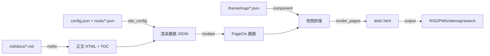

# 渲染管线是如何实现的

本文从代码层面说明一篇文章从 `.md` 到 `.html` 的完整链路。整体分四步：**Markdown 解析 → 页面数据装配 → 地图拼接 → 收尾产物**。

## 1. Markdown 解析（md4c）

`src/markdown.cpp` 封装 [md4c](https://github.com/mity/md4c)（C 库，GFM 扩展：表格/任务列表/删除线）：

```cpp
// 核心：md4c 回调式渲染，正文流式输出
md_html(src, len, append_cb, &out, MD_FLAG_TABLES | MD_FLAG_TASKLISTS, 0);
```

解析的同时做两件事：

- **TOC 构建**：扫描 `h1~h6` 生成锚点目录树（`build_toc`），供右侧目录组件渲染；
- **Admonitions 展开**：`> [!note]` 块引用在 md4c 输出后二次扫描，替换为带图标的提示框 HTML——这是**构建期渲染**，静态 HTML 里直接可见，不依赖客户端 JS。

## 2. 页面数据装配（ctxdata）

`src/ctxdata.cpp` 把 `PageCtx`（页面上下文）装配成**渲染数据 JSON**：导航树、面包屑、上下篇、页眉、页脚、目录、正文、标签等。关键点：

- **相对基址（relBase）**：子目录页面（`blog/`、`tags/`、`page/N`）的链接自动加 `../` 前缀，贯穿模板/导航/面包屑/上下篇；
- **导航过滤**：多版本共用一个 config，剔除指向当前版本不存在页面的导航链接（避免历史版本死链）；
- **语言切换**：按当前 locale 生成语言下拉数据（`lang_switch`）。

## 3. 地图拼接（component + render_pages）

`src/component.cpp` 实现 **JSON 地图渲染器**：页面 = 按序执行的一组章节（sections），五种约定：

| 约定 | 实现 |
|---|---|
| `{"html": "..."}` | 原样输出（可含 `{{key}}` 数据孔） |
| `{"component": "Name"}` | 加载 `themes/<name>/components/**/<Name>.html` |
| `+ "if": "path"` | 数据路径真值才渲染 |
| `+ "each": "path"` | 数组循环渲染（每项合并进数据作用域） |
| `+ "sections": [...], "props": {...}` | 子章节结果填 `{{slot}}`；props 传参优先级最高 |

**数据作用域**：全局页面数据 < each 当前项 < props。组件是纯 HTML + `{{field}}` 数据孔，无控制流——条件/循环/嵌套全是 JSON 字段，C++ 不硬编码任何页面骨架。

## 4. 收尾产物（output）

`src/output.cpp` 在页面渲染后统一生成：

- **根重定向** `index.html`：多语言/多版本时根页面自动跳转默认语言/版本；
- **RSS + JSON Feed**：`src/feeds.cpp`，每语言一份 + 根默认语言；
- **PWA**：`src/pwa.cpp`（manifest + service worker）；
- **sitemap.xml / robots.txt**：SEO 收尾；
- **search.json**：FlexSearch 客户端索引（`src/search.cpp`）。

## 数据流全景



> 设计要点：**引擎只产数据和拼页面**。页面结构（map）、元素（components）、文案（i18n）、外观（CSS 变量）全部外部化，升级渲染内核（md4c/highlight.js）即可获得新能力，无需改业务代码。
